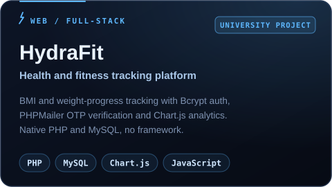
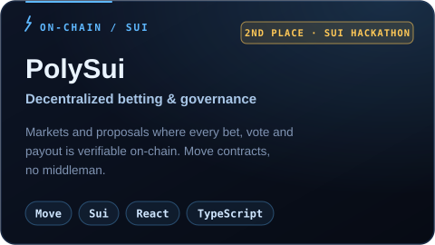
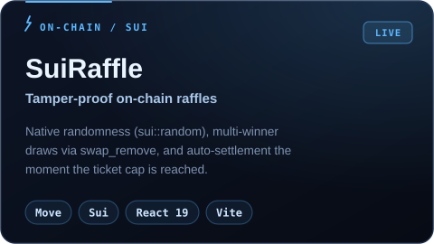
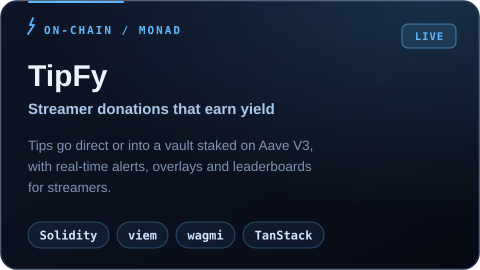
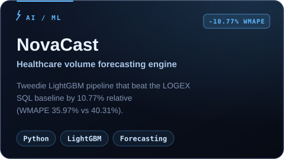
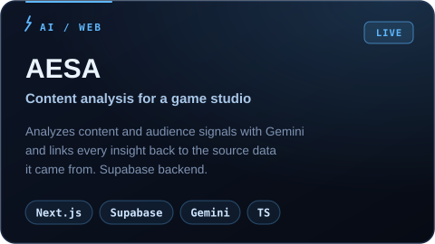
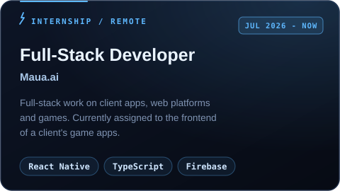
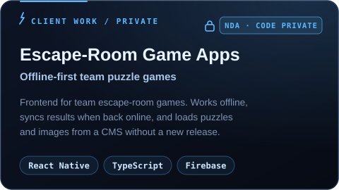

  

  
  
  
  
  
  

 

 

## Featured Projects (open source)

<table>
  <tr>
    <td width="50%" valign="top">
      
      
<a href="https://github.com/YosuaSurianto/HydraFit-Public-Version">Source</a>

    </td>
    <td width="50%" valign="top">
      
      
<a href="https://deepbook-iota.vercel.app/">Live demo</a> · <a href="https://github.com/YosuaSurianto/PolySUI">Source</a>

    </td>
  </tr>
  <tr>
    <td width="50%" valign="top">
      
      
<a href="https://suiraffle.vercel.app/">Live demo</a> · <a href="https://github.com/YosuaSurianto/SuiRaffle">Source</a>

    </td>
    <td width="50%" valign="top">
      
      
<a href="https://github.com/YosuaSurianto/tipfy-2">Source</a>

    </td>
  </tr>
  <tr>
    <td width="50%" valign="top">
      
      
<a href="https://github.com/YosuaSurianto/NovaCast">Source</a>

    </td>
    <td width="50%" valign="top">
      
      
<a href="https://aesa-mu.vercel.app/">Live demo</a> · <a href="https://github.com/YosuaSurianto/AESA">Source</a>

    </td>
  </tr>
</table>

## Experience

<table>
  <tr>
    <td width="50%" valign="top">
      
    </td>
    <td width="50%" valign="top">
      
    </td>
  </tr>
</table>

## Tech Stack

<b>Languages</b> 
  

<b>Frontend &amp; Mobile</b> 
   
  
  
  
  

<b>Web3</b> 
  
  
  
  
  
  
  
  

<b>Backend, Data &amp; AI</b> 
   
  
  
  
  

<b>Tools</b> 
  

<picture>
  <source media="(prefers-color-scheme: dark)" srcset="https://raw.githubusercontent.com/YosuaSurianto/YosuaSurianto/output/pacman-contribution-graph-dark.svg">
  <source media="(prefers-color-scheme: light)" srcset="https://raw.githubusercontent.com/YosuaSurianto/YosuaSurianto/output/pacman-contribution-graph.svg">
  
</picture>

